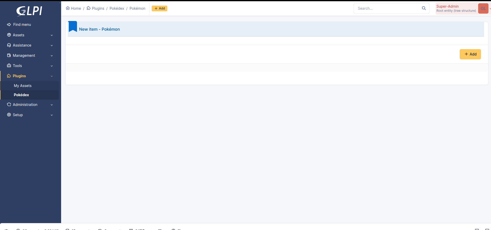
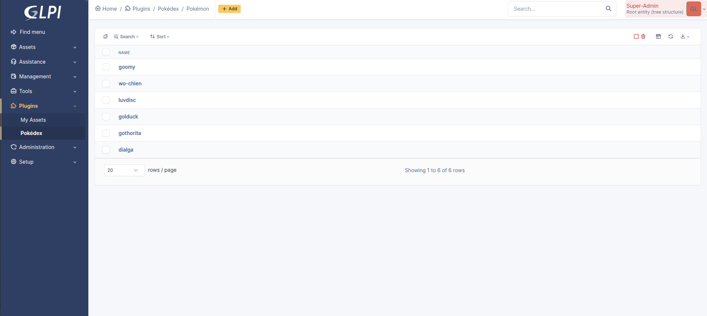
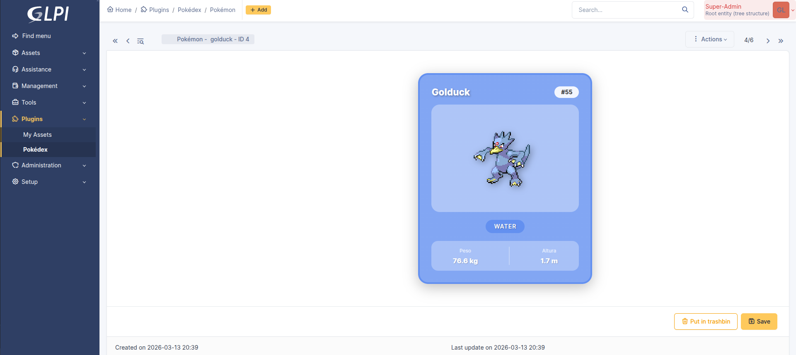
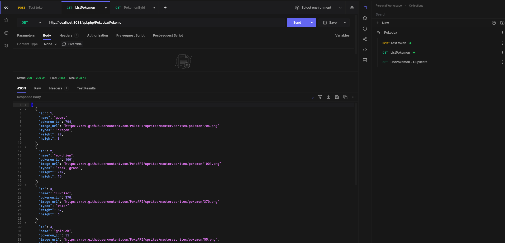
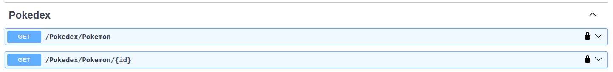

# Pokedex Plugin for GLPI 11

> **This is a learning project.** It was built as a hands-on practice exercise to understand GLPI 11 plugin development. It has no commercial purpose whatsoever.

A GLPI 11 plugin that integrates with the [PokeAPI](https://pokeapi.co/) to manage Pokemon inside GLPI. When you click "Add", a random Pokemon is fetched from the PokeAPI and stored in the database, displayed as a styled card with type-based color gradients. The plugin also exposes authenticated REST API endpoints so external apps (e.g. a mobile app) can query the registered Pokemon.

## Screenshots

### Adding a new Pokemon
Just click **+ Add** and a random Pokemon is fetched from the PokeAPI automatically — no manual input needed.



### Pokemon list in GLPI
All registered Pokemon are displayed using GLPI's built-in search engine with sorting and filtering capabilities.



### Pokemon card detail
Each Pokemon is shown as a styled card with type-based gradient colors, sprite image, weight and height.



### REST API response
External applications can query Pokemon data through authenticated API endpoints.



## What was learned building this plugin

### GLPI 11 Plugin Architecture
- Plugin lifecycle: `setup.php` (registration & hooks), `hook.php` (install/uninstall), `src/` (PSR-4 classes)
- PSR-4 autoloading with the `GlpiPlugin\Pokedex` namespace
- Hook system: `Hooks::MENU_TOADD`, `Hooks::ADD_CSS`, `Hooks::API_CONTROLLERS`
- File-based routing: each URL maps directly to a PHP file on disk (`front/pokemon.php`, `front/pokemon.form.php`)

### CommonDBTM Lifecycle
- How `add()` calls `prepareInputForAdd()` internally (hardcoded in `CommonDBTM::add()`)
- Overriding `prepareInputForAdd()` to intercept and modify data before database insertion
- Using `prepareInputForAdd()` to auto-populate fields from an external API (PokeAPI)
- CRUD operations: `add()`, `update()`, `delete()`, `restore()`, `getFromDB()`

### Twig Templating
- Extending GLPI's `generic_show_form.html.twig` with ``
- Building dynamic HTML (Pokemon card) with CSS custom properties set from Twig variables
- Using type-based color maps for dynamic gradient backgrounds

### Static Resources in GLPI 11
- GLPI 11 requires static resources (CSS, JS, images) to be placed under `public/` directory
- The `RequestRouterTrait` prepends `/public` to static plugin resource paths

### High-Level API v2 (REST Endpoints)
- Creating custom API controllers extending `AbstractController`
- PHP 8 attributes for route definition: `#[Route]` and `#[RouteVersion]`
- Registering plugin controllers via `Hooks::API_CONTROLLERS`
- Route security levels: `Route::SECURITY_AUTHENTICATED` vs `Route::SECURITY_NONE`
- API route caching mechanism (5-minute cache in `$GLPI_CACHE`)

### OAuth2 Authentication
- Configuring OAuth2 clients in GLPI (`glpi_oauthclients` table)
- Password grant flow: `POST /api.php/token` with client credentials + user credentials
- Bearer token authentication for API endpoints
- OAuth2 scopes: the `api` scope is required for custom plugin endpoints

## Plugin Structure

```
pokedex/
├── setup.php                          # Plugin registration & hooks
├── hook.php                           # Install (create table) / Uninstall (drop table)
├── front/
│   ├── pokemon.php                    # Search/list page
│   └── pokemon.form.php              # CRUD form handler
├── src/
│   ├── Pokemon.php                    # Main itemtype (CommonDBTM) with PokeAPI integration
│   └── Api/
│       └── PokedexController.php      # REST API controller (list & get by ID)
├── templates/
│   └── pokemon.form.html.twig         # Pokemon card template
└── public/
    └── css/
        └── pokemon-card.css           # Card styles (gradients, hover effects, transitions)
```

## API Endpoints

All endpoints require OAuth2 Bearer token authentication.

| Method | Endpoint | Description |
|--------|----------|-------------|
| `POST` | `/api.php/token` | Get OAuth2 access token |
| `GET` | `/api.php/Pokedex/Pokemon` | List all Pokemon |
| `GET` | `/api.php/Pokedex/Pokemon/{id}` | Get a single Pokemon by ID |

### Swagger UI (Interactive API docs)

GLPI 11 includes built-in Swagger UI that automatically documents all API endpoints, including those from plugins. The Pokedex endpoints appear under the **Pokedex** tag with their descriptions.



To access Swagger UI:
1. Log in to GLPI in your browser (e.g. `http://localhost:8083`)
2. Navigate to `http://localhost:8083/api.php/swagger` in the same browser

You must be logged in to GLPI first, as Swagger UI uses cookie-based authentication. From there, you can browse, test and interact with all available API endpoints directly from the browser.

The OpenAPI schema is also available in JSON format at `/api.php/v2/doc.json`.

### Authentication flow

```bash
# 1. Get access token
curl -X POST http://localhost:8083/api.php/token \
  -H "Content-Type: application/x-www-form-urlencoded" \
  -d "grant_type=password&client_id=YOUR_CLIENT_ID&client_secret=YOUR_CLIENT_SECRET&username=glpi&password=glpi&scope=api"

# 2. Use the token to query Pokemon
curl http://localhost:8083/api.php/Pokedex/Pokemon \
  -H "Authorization: Bearer YOUR_ACCESS_TOKEN"
```

## Requirements

- GLPI >= 11.0.0
- PHP >= 8.1
- Internet access (to fetch data from PokeAPI)

## Installation

1. Clone this repository into your GLPI plugins directory:
   ```bash
   cd /path/to/glpi/plugins
   git clone https://github.com/javierlago/glpi-plugin-pokedex.git pokedex
   ```
2. Go to **Setup > Plugins** in GLPI
3. Click **Install** and then **Enable** the Pokedex plugin
4. Navigate to **Plugins > Pokedex** in the sidebar

## License

GPLv3+
